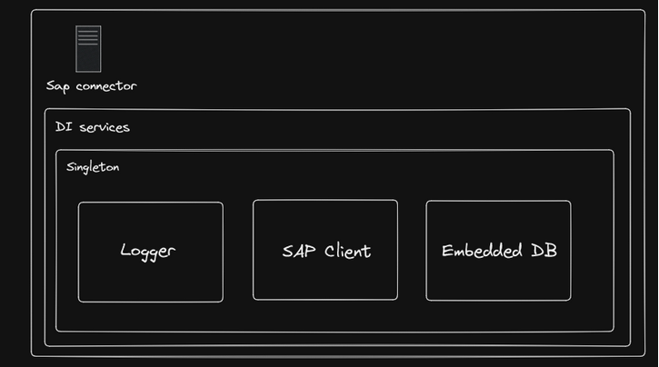

# Arquitectura del conector de SAP B1

El conector de SAP es un api programada en **ASP.NET 6.0**, la cual tiene los siguientes servicios registrados en su definicion de inyeccion de dependencias



- Logger (**Global**): Se encarga de todas las tareas relacionadas con el logging del api, esta instancia esta basada en el Singleton que ofrece Serilog.

```cs
using Serilog;

// Not the real code, just an example
using var logger = new LoggerConfiguration()
    .WriteTo.Console()
    .CreateLogger()

// Singleton instance
Log.Logger = logger;

builder.Logging.ClearProviders();
builder.Logging.AddSerilog(Log.Logger);
```

- SapClient (**Dependency injection**): Se encarga de todas las operaciones que se tengan que ejecutar con el SDK de SAP B1, se cuenta con una interfaz **ISapClient** que va mas en detalle sobre el contrato entre los controladores y el cliente.

```cs
// Singleton instantiation
builder.Services.AddSingleton<ISapClient>(
    _ => new SapClient(
        new IConnectionSettings(
            builder.Configuration["ConnectionData:UserName"],
            builder.Configuration["ConnectionData:Password"],
            builder.Configuration["ConnectionData:Server"],
            builder.Configuration["ConnectionData:CompanyDB"],
            builder.Configuration["ConnectionData:DbUserName"],
            builder.Configuration["ConnectionData:DbPassword"]
        )
));
```

- Embbeded DB (**Dependency injection**): Este servicio basicamente contiene la informacion de sesiones, estas sesiones son manejadas mediante **tokens JWT** y su autenticacion es mediante **Credenciales del Active Directory**.

> Los servicios globales son aquellos a los cuales se puede acceder a su instancia Singleton sin necesidad de injeccion de dependencias, un claro ejemplo de estos es el servicio de Logger, ya que este se puede acceder facilmente mediante `using Serilog; Log.Information("Test")`

## Tipos importantes

- ISapClient
    - SapClient
- QueryManager: Esta clase es la que se encarga de manejar todas las operaciones de modificacion y obtencion de query's de manera estatica (principalmente usado en QueryController)

## Estructura del api

> El api hace uso del modelo **MVC**

### Modelos

- SapClient (implementacion de ISapClient)
- QueryManager (Deprecado)

### Controlladores

- Query
- Controlador para cada Bob (Bussiness object) de SAP con los metodos PUT, GET, DELETE, UPDATE. estos metodos se deben usar para implementar CRUD
    - PUT: Creacion
    - UPDATE: Actualizacion
    - DELETE: Eliminar
    - GET: Obtener datos

# Implementacion autenticacion y autorizacion

TODO


