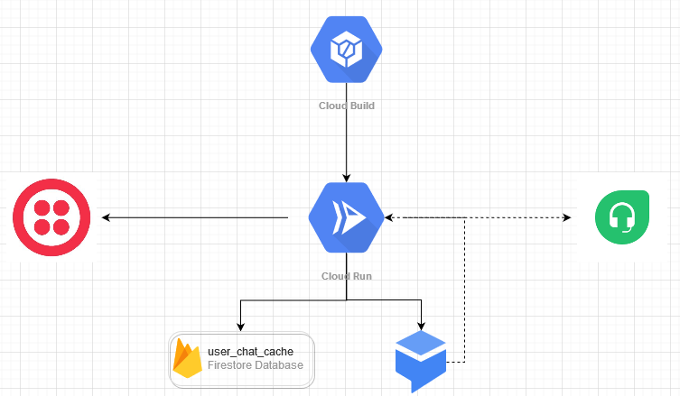

# FirplakBot en la nube de Google

## Descripcion

El despliegue del bot en la nube de Google sigue el siguiente diagrama:

Como se ve en el diagrama, el despliegue usa las siguientes herramientas:

### Herramientas de la nube de Google

Todas las herramientas de la nube de Google estan bajo la cuenta **cloud.firplak@gmail.com** cuya contraseña esta en el Keepass de sistemas.

* **Cloud Build**:
    Este se usa para hacer la build del contenedor de Docker que contiene el codigo necesario para la implementacion con Twilio, esto permite que con un Makefile que esta en el repositorio del aplicativo se pueda desplegar de manera casi inmediata.
    * [**Ir al panel de administracion**](https://console.cloud.google.com/cloud-build/builds?authuser=2&project=firplakbot)
* **Cloud Run**:
    En esta herramienta se ejecuta el codigo que permite la implementacion con Twilio y contiene la logica de negocio propia del Bot (cache, bot simple, etc).
    * [**Ir al panel de administracion**](https://console.cloud.google.com/run?authuser=2&project=firplakbot)
* **DialogFlow**:
    Esta herramienta es la encargada de hacer el reconocimiento de lenguaje natural y comunicarse con la implementacion.
    * [**Ir al panel de administracion**](https://dialogflow.cloud.google.com/#/agent/firplakbot/intents)
* **Firebase Storage**
    En esta herramienta se guarda el cache de conversaciones para poder dar respuestas acorde al historial de mensajes.
    * [**Ir al panel de administracion**](https://console.firebase.google.com/u/2/project/firplakbot/overview)
---
### Herramientas externas a la nube de Google

Para acceder al api de Freshdesk es necesario conseguir el API key desde el perfil del agente en la interfaz de la aplicacion, [**Ver como**](https://support.freshdesk.com/support/solutions/articles/215517-how-to-find-your-api-key), y para acceder a Twilio se ingresa con la cuenta que esta en el Keepass.

* **Freshdesk API**:
    Con esta herramienta nos comunicamos con nuestra mesa de ayuda Freshdesk.
    * [**Ir a la documentacion**](https://developers.freshdesk.com/api/)
* **Twilio**:
    Esta herramienta es la que nos permite conectar con el servicio de mensajeria que en este caso es Whatsapp, sin embargo podemos hacer uso de diferentes medios como telefono, sms, etc.
    * [**Ir al panel de administracion**](https://console.twilio.com/?frameUrl=%2Fconsole%3Fx-target-region%3Dus1)